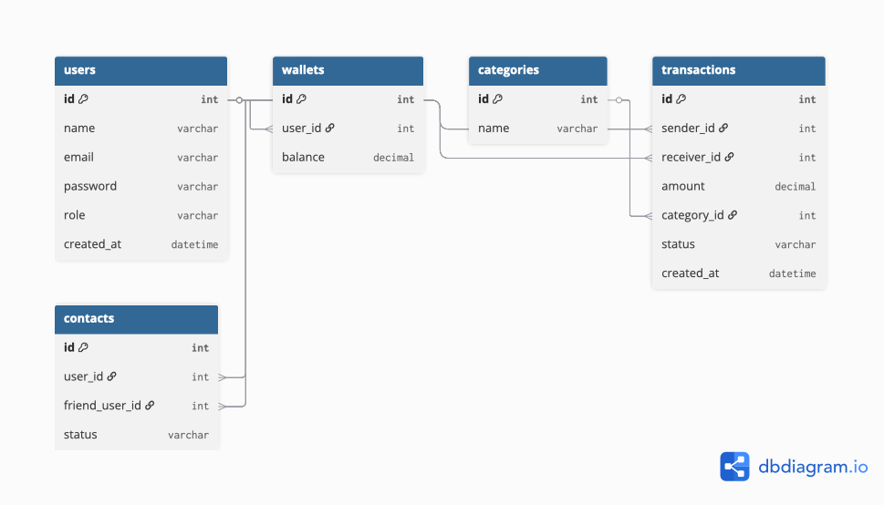

        # Nummo - Milestone 1 Starter

        This is a scaffold for the Nummo project (Milestone 1). The frontend is static and works as an SPA. The backend contains FlightPHP stubs and a PDO-based DAO example.

## Quick local run
1. Serve frontend:
   cd frontend
   python3 -m http.server 8000

2. Install backend deps and run (when ready):
   cd backend
   composer install
   php -S localhost:8080

3. Import SQL:
   mysql -u root -p < ../sql/nummo_schema.sql
   
   
