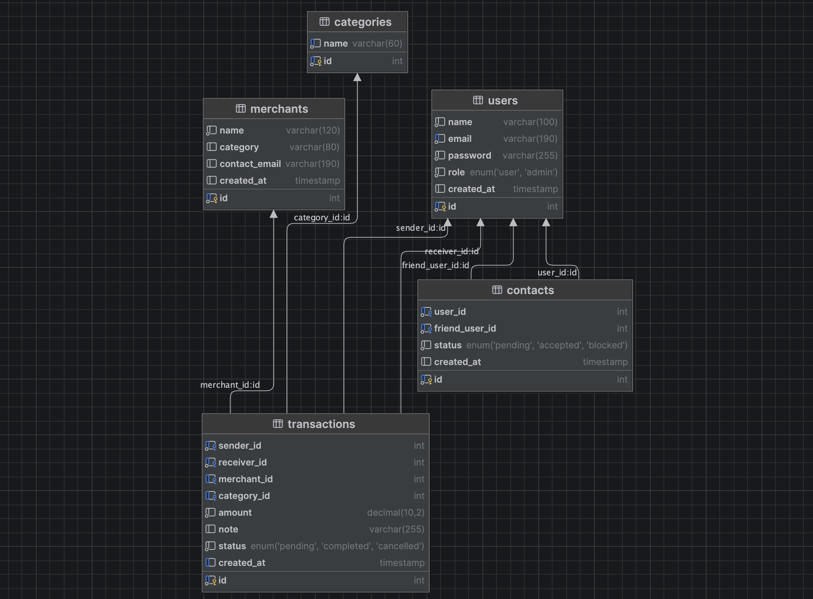

# 💳 Nummo — Peer-to-Peer Payment App (Milestone 2)

Nummo is a **mock peer-to-peer payment platform** inspired by Venmo, built as part of the Web Programming course.  
The project is structured as a **single-page web application (SPA)** with a PHP + MySQL backend and a modern frontend.

This version completes **Milestone 2**, which focuses on database setup and the DAO (Data Access Object) layer.

---

## 🚀 Features Implemented (Milestone 2)

✅ **Database Schema**  
- Created `nummo_db` with fully normalized tables:  
  `users`, `contacts`, `transactions`, `categories`, `merchants`.  
- Includes relationships (FK constraints) and demo data.

✅ **DAO Layer (PHP + PDO)**  
- Implemented secure CRUD operations for all major entities.  
- Verified with `dao_test.php` using prepared statements.  
- Tested connection and queries via `Database.php`.

✅ **Frontend SPA**  
- Static single-page architecture using Bootstrap 5.  
- Router-based navigation (Dashboard / Transactions / Profile / Login / Register).  
- Live dashboard mockup with transaction summary and Chart.js integration.  
- Clean, responsive UI.

✅ **Code Structure**
nummo-webapp/
│
├── backend/
│ ├── config/Database.php
│ ├── dao/
│ │ ├── UserDao.php
│ │ ├── TransactionDao.php
│ │ ├── MerchantDao.php
│ │ ├── ContactDao.php
│ │ └── CategoryDao.php
│ └── test/dao_test.php
│
├── frontend/
│ ├── assets/
│ │ ├── css/style.css
│ │ └── js/
│ │ ├── router.js
│ │ ├── dashboard.js
│ │ └── transactions.js
│ └── index.html
│
└── sql/nummo_schema.sql

---

## 🧩 Quick Local Run

### 1️⃣ Run the frontend
```bash
cd frontend
python3 -m http.server 8000
Visit → http://localhost:8000

2️⃣ Run the backend (when needed)
cd backend
composer install
php -S localhost:8080

3️⃣ Import the database
mysql -u root -p < sql/nummo_schema.sql

## 🧩 Database Diagram



## 🚀 Milestone 3 — Live API, Filters & Transaction Creation

**New Features**
- Live backend integration with FlightPHP and MySQL  
- Transaction filters by status and category  
- Add Transaction form with POST API  
- Real-time data rendering with Bootstrap styling  
- Backend modularized (DAO, routes, config, public entry point)

**Next Steps**
- Implement authentication  
- Add transaction editing and deletion  
- Display user balances dynamically  


👩‍💻 Author

Dzejna Sejfic
Burch International University – IT Department
“Built with ❤️ and PHP.”

